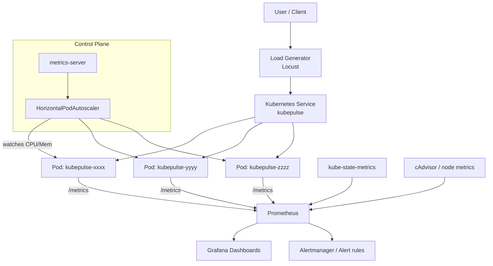

# KubePulse Architecture

## Overview

KubePulse is a small FastAPI service instrumented for Prometheus, deployed
to Kubernetes with production-style reliability controls (probes, resource
limits, rolling updates, HPA), and surrounded by an observability and
failure-injection toolchain that demonstrates core SRE practices.

## Request / data flow

## Components

| Component | Role |
|---|---|
| **app/** (FastAPI) | Serves HTTP endpoints, exposes `/metrics` in Prometheus text format |
| **Kubernetes Deployment** | Runs 2+ replicas with liveness/readiness/startup probes, resource requests/limits, rolling updates |
| **Kubernetes Service** | Stable ClusterIP in front of the pods |
| **HorizontalPodAutoscaler** | Scales replicas 2→8 based on CPU (and memory) utilisation |
| **Prometheus** | Scrapes `/metrics` from every pod, kube-state-metrics, and cAdvisor; evaluates alert rules |
| **kube-state-metrics** | Exposes Kubernetes object state (replica counts, restarts, HPA status) as metrics |
| **Grafana** | Visualises golden signals (latency, traffic, errors, saturation) from Prometheus |
| **Locust** | Generates configurable load for latency/throughput/HPA experiments |
| **Terraform** | Provisions the Kubernetes-side resources (namespace, deployment, service, HPA) declaratively, against a local cluster |
| **GitHub Actions** | CI (lint/test/build) and CD (build, push, deploy) |

## Why this stack

- **FastAPI**: async, typed, minimal boilerplate, first-class OpenAPI docs — a realistic choice for a small production service.
- **prometheus-client**: the standard, dependency-light way to expose Prometheus metrics from Python without extra sidecars.
- **Kubernetes-native reliability primitives** (probes, HPA, rolling updates, PDB) rather than a bespoke reliability layer, since the goal is to demonstrate *how Kubernetes itself* provides reliability.
- **Terraform against the Kubernetes provider** rather than a cloud provider: this keeps the whole project runnable for free on a local cluster (kind/minikube/k3d), while still exercising real IaC workflows (`plan`/`apply`/`destroy`).
- **Locust**: Python-native, easy to script realistic mixed traffic (light reads, CPU-heavy work, artificial latency, controlled errors) in the same language as the app.
- **Prometheus + Grafana**: the de facto standard observability stack for Kubernetes, well supported by kube-state-metrics/cAdvisor for infrastructure-level golden signals.

## Local development topology

For local development without a cluster, `docker-compose.yml` runs the app,
Prometheus and Grafana as three containers on a single Docker network —
sufficient to validate metrics, dashboards and alert rule *evaluation*
end-to-end, without needing Kubernetes-specific metrics (pod restarts, HPA
status) which require a real cluster with kube-state-metrics.

## Kubernetes topology

For the full experience (HPA, rolling updates, pod-failure recovery,
kube-state-metrics-backed dashboards), deploy to a local cluster created
with `kind`, `minikube`, or `k3d`, then apply the manifests in `k8s/`
(directly with `kubectl apply -k k8s/`, or via `terraform/`).
